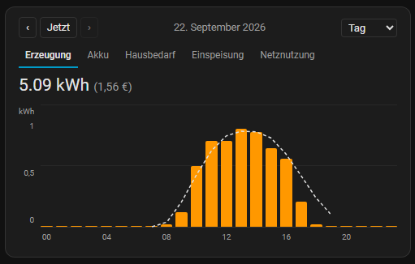
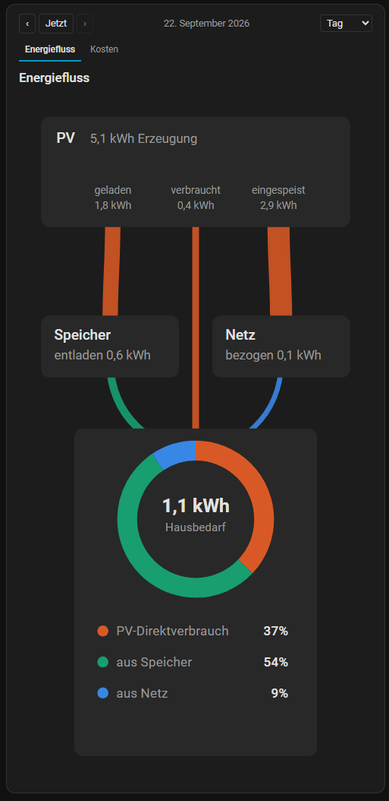
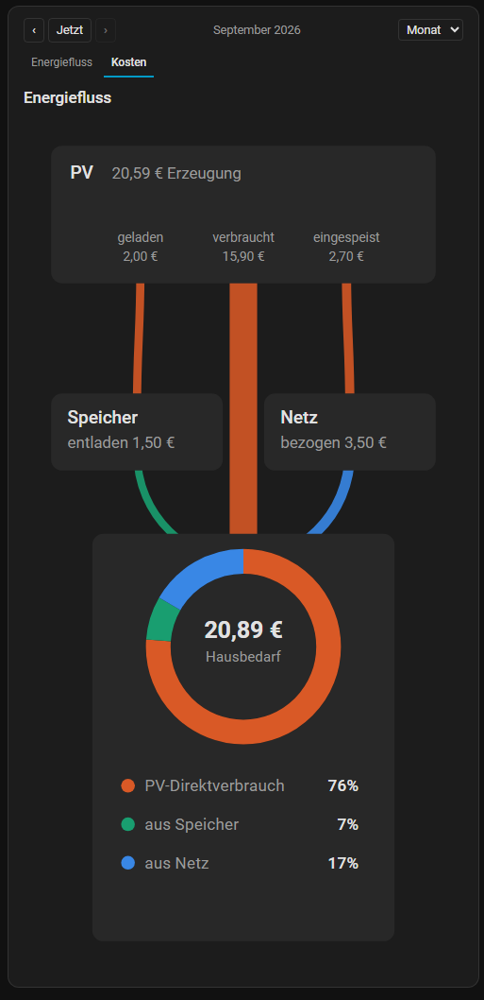

# Solar & Energiefluss Cards

Drei eigenständige Lovelace-Karten für Home Assistant rund um eine Solaranlage
(entwickelt für einen Anker Solix Pro 2, funktioniert aber mit jedem Setup, das
passende Energie-Sensoren liefert):

- **PV Energy Diagram** — Solarerzeugung als Balkendiagramm (Tag/Woche/Monat/Jahr),
  mit Navigation, Prognoselinie, Tooltips und optionaler Kostenanzeige.
- **PV Energy Flow Card** — zeigt, woher der Hausbedarf kommt (PV direkt / Speicher / Netz)
  als kombiniertes Ring- und Sankey-Diagramm, plus optionalem Kosten/Gespart-Tab.
- **PV Battery Card** — Akkustand als Batterie-Symbol mit Farbverlauf, aktueller
  Lade-/Entladeleistung und einer Prognose, wann der Akku voraussichtlich voll ist.

Alle drei Karten holen ihre Daten unabhängig voneinander direkt per Websocket
(`recorder/statistics_during_period`, `energy/solar_forecast`) — sie nutzen **nicht**
die gemeinsame Energy-Dashboard-Datumsauswahl, mehrere Karteninstanzen auf einem
Dashboard beeinflussen sich also nicht gegenseitig.

## Voraussetzungen

- Home Assistant mit aktiviertem `recorder` (Standard) und den benötigten Sensoren
  als **Langzeitstatistik** (state_class `total_increasing`, üblich bei
  Energie-Sensoren von Wechselrichtern/Zählern)
- Für die Prognoselinie der Solar-Karte: eine [Forecast.Solar](https://www.home-assistant.io/integrations/forecast_solar/)-Quelle,
  im Energie-Dashboard (Einstellungen → Dashboards → Energie) als Solarprognose hinterlegt

## Installation über HACS

Dieses Repository ist (noch) nicht im HACS-Standardkatalog gelistet und muss als
**benutzerdefiniertes Repository** hinzugefügt werden:

1. HACS öffnen → oben rechts auf die drei Punkte → **Benutzerdefinierte Repositories**
2. Repository-URL eintragen, Kategorie **Dashboard** auswählen, hinzufügen
3. "Solar & Energiefluss Cards" in HACS suchen und installieren
4. Home Assistant neu laden (Browser-Cache ggf. hart leeren)
5. Falls die Ressource nicht automatisch eingetragen wurde: Einstellungen →
   Dashboards → oben rechts drei Punkte → Ressourcen → hinzufügen:
   `/hacsfiles/<Repo-Name>/solar-cards.js`, Typ **JavaScript-Modul**

## Manuelle Installation (ohne HACS)

1. `solar-cards.js` von der [neuesten Release](../../releases/latest) herunterladen
2. Datei nach `<config>/www/solar-cards.js` kopieren
3. Als Ressource einbinden: Einstellungen → Dashboards → ⋮ → Ressourcen → hinzufügen:
   `/local/solar-cards.js`, Typ **JavaScript-Modul**

## PV Energy Diagram



Solarerzeugung als Balkendiagramm mit gestrichelter Prognoselinie (aus
Forecast.Solar) und optionaler Kostenanzeige neben der Summe.

```yaml
type: custom:pv-energy-diagram
title: Solar
entity_1: sensor.pv_erzeugung_taeglich
name_1: Erzeugung
```

Bis zu 5 Entitäten mit eigenem Namen sind möglich (per Tabs umschaltbar,
z. B. mehrere Wechselrichter/Strings) — dafür `entity_2`…`entity_5` und
`name_2`…`name_5` ergänzen. Alle Optionen (Zeiträume, Prognose, Balkenfarbe,
Diagrammhöhe, Strompreis) lassen sich bequem über den visuellen Editor setzen
(Karte hinzufügen → kein YAML nötig).

## PV Energy Flow Card

<p>
  
  
</p>

Zeigt, woher der Hausbedarf kommt (PV direkt / Speicher / Netz) als
kombiniertes Ring- und Sankey-Diagramm (links). Der zweite Tab "Kosten"
(rechts) zeigt exakt dieselbe Grafik, nur mit €- statt kWh-Werten.

```yaml
type: custom:pv-energy-flow-card
title: Energiefluss
pv_entity: sensor.pv_erzeugung
battery_charge_entity: sensor.batterie_laden
battery_discharge_entity: sensor.batterie_entladen
grid_import_entity: sensor.netzbezug
grid_export_entity: sensor.netzeinspeisung
```

Der PV-Direktverbrauch wird automatisch berechnet
(PV-Erzeugung − Batterie-Laden − Netzeinspeisung) — dafür ist kein eigener Sensor nötig.
Mit einem hinterlegten Strompreis (`price_per_kwh`, im visuellen Editor einstellbar)
erscheint zusätzlich der oben gezeigte "Kosten"-Tab.

## PV Battery Card


Zeigt den Akkustand als Batterie-Symbol, dessen Füllfarbe stufenlos zwischen
Rot (0 %), Orange (50 %) und Grün (100 %) verläuft. Darunter die aktuelle
Lade-/Entladeleistung (↑/↓ mit Watt-Wert, oder "Im Ruhezustand" bei sehr
kleinen Werten) sowie eine Prognose, wann der Akku voraussichtlich voll ist.

```yaml
type: custom:pv-battery-card
title: Akkustand
soc_entity: sensor.akku_ladestand
charge_power_entity: sensor.akku_ladeleistung
discharge_power_entity: sensor.akku_entladeleistung
battery_capacity_kwh: 3.2
```

Für die Ladezeit-Prognose gibt es keinen fertigen "Hausverbrauch"-Sensor,
sondern die Grundlast wird aus drei weiteren Momentanleistungssensoren live
berechnet (PV-Erzeugung + Netzbezug − Netzeinspeisung − Batterieleistung),
gemittelt über die letzten 3 Stunden, um kurze Verbrauchsspitzen wegzumitteln.
Ohne diese drei optionalen Felder zeigt die Karte nur Ladestand und Leistung,
ohne Ladezeit-Zeile:

```yaml
type: custom:pv-battery-card
title: Akkustand
soc_entity: sensor.akku_ladestand
charge_power_entity: sensor.akku_ladeleistung
discharge_power_entity: sensor.akku_entladeleistung
battery_capacity_kwh: 3.2
pv_power_entity: sensor.pv_erzeugung_leistung
grid_import_power_entity: sensor.netzbezug_leistung
grid_export_power_entity: sensor.netzeinspeisung_leistung
```

## Entwicklung

```bash
npm install
npm run start   # baut im Watch-Modus und startet einen lokalen Server für dist/
```

Die gebaute Datei liegt danach unter `dist/solar-cards.js` und ist per lokalem Server
unter `http://<dein-rechner>:5000/solar-cards.js` erreichbar (als HA-Ressource vom Typ
„JavaScript-Modul" einbinden).

```bash
npm run build   # einmaliger Produktions-Build
npm run lint    # ESLint
```

## Release erstellen

Ein Tag im Format `v*` (z. B. `v1.0.0`) pushen — eine GitHub Action baut die Karten
automatisch und veröffentlicht `solar-cards.js` als Anhang eines neuen GitHub-Release,
das HACS anschließend zum Download anbietet.

## Lizenz

[MIT](LICENSE)
