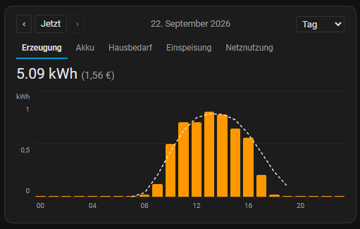
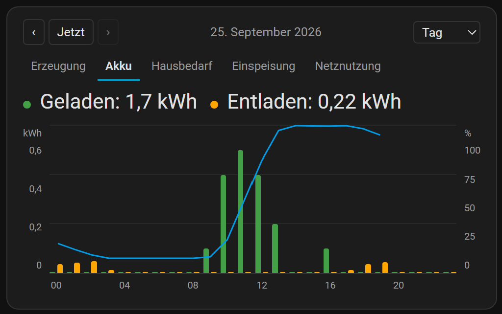
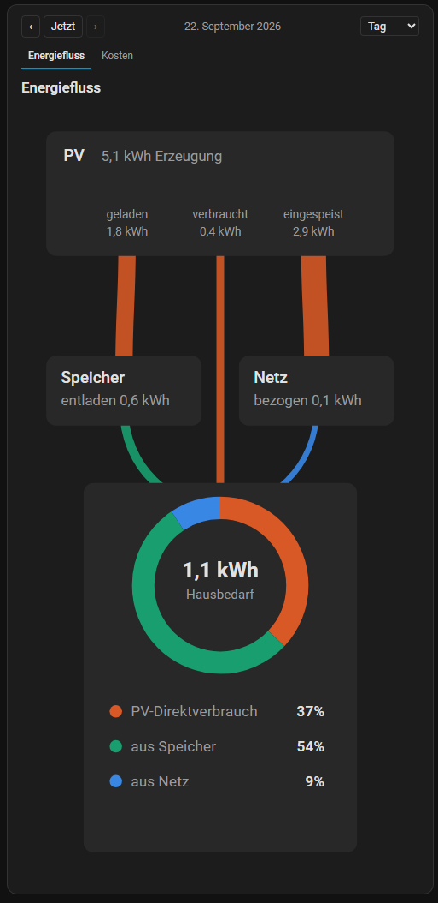
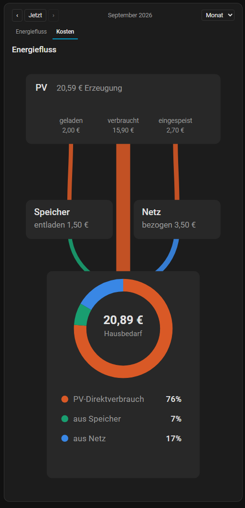

# SolarEnergy Lens Cards

Four independent Lovelace cards for Home Assistant built around a solar setup
(developed for an Anker Solix Pro 2, but works with any setup that provides
matching energy sensors):

- **PV Energy Diagram** — solar generation as a bar chart (day/week/month/year),
  with navigation, a forecast line, tooltips, and an optional cost display.
- **PV Energy Flow Card** — shows where household consumption comes from (direct PV /
  battery / grid) as a combined ring and Sankey diagram, plus an optional cost/savings tab.
- **PV Battery Card** — battery level as a battery icon with a color gradient, current
  charge/discharge power, and a forecast for when the battery will be full.
- **PV Payback Card** — shows how much money your solar setup has saved so far, as a
  percentage of its purchase cost, plus a savings-over-time chart with a break-even estimate.

All four cards fetch their data independently of each other directly via websocket
(`recorder/statistics_during_period`, `energy/solar_forecast`) — they do **not** use
the shared Energy dashboard date selection, so multiple card instances on one
dashboard don't affect each other.

## Requirements

- Home Assistant with `recorder` enabled (default) and the required sensors
  recorded as **long-term statistics** (state class `total_increasing`, typical for
  energy sensors on inverters/meters)
- For the solar card's forecast line: a [Forecast.Solar](https://www.home-assistant.io/integrations/forecast_solar/)
  source, configured in the Energy dashboard (Settings → Dashboards → Energy) as a solar forecast

## Installation via HACS

This repository is not (yet) listed in the HACS default store and must be added
as a **custom repository**:

1. Open HACS → three dots in the top right → **Custom repositories**
2. Enter the repository URL, select category **Dashboard**, add it
3. Search for "SolarEnergy Lens Cards" in HACS and install it
4. Reload Home Assistant (hard-refresh the browser cache if needed)
5. If the resource wasn't added automatically: Settings →
   Dashboards → three dots in the top right → Resources → add:
   `/hacsfiles/solarenergy-lens-cards/solar-cards.js`, type **JavaScript Module**

## Manual installation (without HACS)

1. Download `solar-cards.js` from the [latest release](../../releases/latest)
2. Copy the file to `<config>/www/solar-cards.js`
3. Add it as a resource: Settings → Dashboards → ⋮ → Resources → add:
   `/local/solar-cards.js`, type **JavaScript Module**

## PV Energy Diagram



Solar generation as a bar chart with a dashed forecast line (from
Forecast.Solar) and an optional cost display next to the total.

```yaml
type: custom:pv-energy-diagram
title: Solar
entity_1: sensor.pv_erzeugung_taeglich
name_1: Generation
```

Up to 5 entities with their own names are supported (switchable via tabs,
e.g. multiple inverters/strings) — just add `entity_2`…`entity_5` and
`name_2`…`name_5`. All options (periods, forecast, bar color,
chart height, electricity price) can be set conveniently via the visual editor
(add card → no YAML needed).



The second tab slot is reserved for the battery: instead of a single
entity, three sensor roles are configured here (energy charged/discharged
in kWh, and state of charge in %). In the day view, a solid
line additionally shows the state-of-charge trend on its own
0–100% scale.

```yaml
entity_2_charge: sensor.akku_geladen
entity_2_discharge: sensor.akku_entladen
entity_2_soc: sensor.akku_ladestand
name_2: Battery
```

## PV Energy Flow Card

<p>
  
  
</p>

Shows where household consumption comes from (direct PV / battery / grid) as a
combined ring and Sankey diagram (left). The second "Cost" tab
(right) shows the exact same graphic, just with €- instead of kWh-values.

```yaml
type: custom:pv-energy-flow-card
title: Energy Flow
pv_entity: sensor.pv_erzeugung
battery_charge_entity: sensor.batterie_laden
battery_discharge_entity: sensor.batterie_entladen
grid_import_entity: sensor.netzbezug
grid_export_entity: sensor.netzeinspeisung
```

Direct PV consumption is calculated automatically
(PV generation − battery charge − grid export) — no separate sensor is needed.
With an electricity price configured (`price_per_kwh`, settable via the visual editor),
the "Cost" tab shown above also appears.

## PV Battery Card


Shows the battery level as a battery icon whose fill color transitions smoothly
between red (0%), orange (50%), and green (100%). Below that, the current
charge/discharge power (↑/↓ with a watt value, or "Idle" for very
small values), plus a forecast for when the battery is expected to be full.

```yaml
type: custom:pv-battery-card
title: Battery
soc_entity: sensor.akku_ladestand
charge_power_entity: sensor.akku_ladeleistung
discharge_power_entity: sensor.akku_entladeleistung
battery_capacity_kwh: 3.2
# Optional, for the charge-time forecast (see below):
pv_power_entity: sensor.pv_erzeugung_leistung
grid_import_power_entity: sensor.netzbezug_leistung
grid_export_power_entity: sensor.netzeinspeisung_leistung
```

There's no ready-made "household consumption" sensor for the charge-time
forecast, so the baseline load is calculated live from the three optional
instantaneous power sensors above (PV generation + grid import − grid export −
battery power), averaged over the last 3 hours to smooth out short
consumption spikes. If one of the three fields is missing, the card shows
only state of charge and power, without the charge-time line.

## PV Payback Card

Shows how much of your solar setup's purchase cost has already been paid back
through savings, as a percentage plus a progress bar, and a chart of cumulative
savings over time — solid up to today, dashed as a projection to the estimated
break-even date. Once paid off, the card switches to showing "Paid off since …"
instead of a projection.

```yaml
type: custom:pv-payback-card
title: Payback
pv_entity: sensor.pv_erzeugung
battery_charge_entity: sensor.batterie_laden
battery_discharge_entity: sensor.batterie_entladen
grid_import_entity: sensor.netzbezug
grid_export_entity: sensor.netzeinspeisung
price_per_kwh: 0.30
investment_cost: 2450
install_date: "2026-03-01"
# Optional: savings from before the sensors/card were set up, added on top
# of the calculated total (see below):
initial_saved_offset: 0
```

Savings are calculated as `(direct PV consumption + battery discharge) × price_per_kwh`,
accumulated from `install_date` onward — the same formula as the Energy Flow
Card's cost tab, just summed over the setup's entire lifetime instead of a
navigable period. The break-even projection uses the rolling **last 12
months** of savings as the yearly rate once that much data is available (this
accounts for summer/winter differences); before that, it falls back to a
rough lifetime average, marked with a "~" prefix and a note.

Since `recorder/statistics_during_period` only has data from whenever a
sensor was first created in Home Assistant — not from your actual purchase
date — set `initial_saved_offset` if the card is set up later than the real
purchase, to manually account for savings from before sensor tracking started.

## Development

```bash
npm install
npm run start   # builds in watch mode and starts a local server for dist/
```

The built file then lives at `dist/solar-cards.js` and is reachable via the local
server at `http://<your-machine>:5000/solar-cards.js` (add it as an HA resource of
type "JavaScript Module").

```bash
npm run build   # one-off production build
npm run lint    # ESLint
```

## Creating a release

Push a tag in the format `v*` (e.g. `v1.0.0`) — a GitHub Action automatically
builds the cards and publishes `solar-cards.js` as an attachment of a new GitHub
release, which HACS then offers for download.

## License

[MIT](LICENSE)
